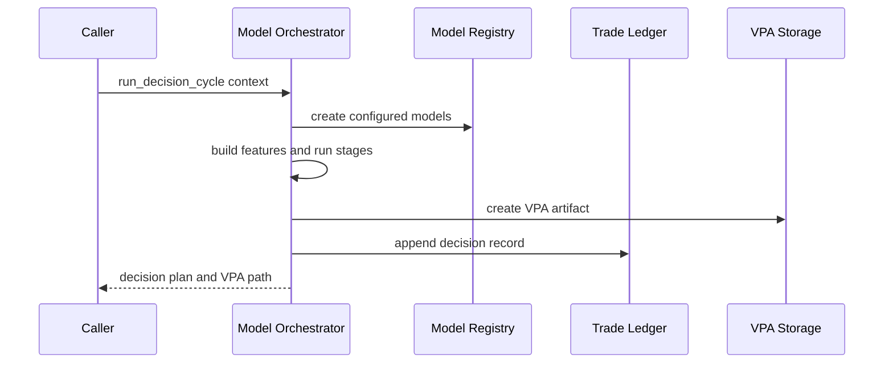

# Decision pipeline and VPA artifacts

`engine/model_orchestrator.py` owns the configurable model-zoo decision path. `ModelOrchestrator.run_decision_cycle(context, dry_run=True)` builds features, runs forecast → signal → allocation → execution-policy stages, emits a decision plan, writes a VPA artifact, and persists a decision through `TradeLedger`. The plan is subsequently consumed by the [execution safety gates](../execution/safety-gates.md); the orchestrator itself returns `execution_result: None` and does not place orders.

This diagram shows the source-backed decision path before a VPA reaches the execution boundary.

## Contracts and failure posture

`models/interfaces.py` defines the extension contracts:

| Stage | Input and output | Validation / fallback in `ModelOrchestrator` |
| --- | --- | --- |
| Forecast | `ForecastModel.predict(features)` → `ForecastResult` | Invalid values become a neutral 1-day forecast with confidence `0.5`. |
| Signal | `SignalModel.generate_signal(features, forecast)` → `SignalResult` | Invalid or unavailable signals become `HOLD` with confidence `0.5`. |
| Allocation | `AllocationModel.allocate(features, signal, portfolio)` → `AllocationResult` | Invalid/unavailable allocations become a zero target. `validate_allocation_result` requires `0.0 <= target_value_pct <= max_position_pct`. |
| Execution policy | `ExecutionModel.get_execution_policy(features, signal, allocation)` → `ExecutionPolicy` | An unavailable policy falls back to immediate `MKT`, `DAY`. |

`_assemble_decision_plan` applies a second important policy: if signal confidence is below `MIN_CONFIDENCE_THRESHOLD`, it changes the action to `HOLD` and records the reason. Any exception from the complete cycle returns a safe `HOLD` plan with `success: False`.

The generated plan includes action, symbol, confidence, target value percentage, order type, optional limit price, reasons, indicators, decision ID/timestamp, model metadata, and learning metadata. It is VPA-compatible in shape, but VPA parsing in `bin/vpa_executor.py` is the final schema consumer. Futures compatibility requires the contract metadata documented in [execution safety gates](../execution/safety-gates.md); the model orchestrator's own assembled plan does not add futures metadata.

## Model registration recipe

The global `ModelRegistry` in `models/registry.py` registers built-ins during import. It maps names from `config/model_zoo.yaml` to classes and is the factory used by the orchestrator.

1. Implement the relevant abstract type in `models/interfaces.py`; return the required result dataclass and a valid version from `get_version()`.
2. Register it in `_register_builtin_models` or call `register_custom_model(model_type, name, model_class)` before the orchestrator first requests it.
3. Set the matching configured name in `config/model_zoo.yaml`. Registration is not enough: the configured string is the consumer-facing selection path.
4. Add a focused behavior test for valid output and malformed output/fallback. Existing tests do not directly cover registry or orchestrator registration, so do not mistake a successful import for behavioral coverage.
5. If changing output fields, validate the VPA consumer path and, for futures, run `python -m pytest tests/test_decision_plan_futures_schema.py -q`.

The [quantum stack](../models/quantum-stack.md) is not registered through this model zoo by inspected code. Its unified-bot integration is a separate runtime surface.

## VPA and ledger persistence

`_create_vpa_artifact` writes the decision plan and associated metadata below the configured `vpa_storage_path`. `TradeLedger` separately creates and appends JSONL records in `state/`: `decisions.jsonl`, `executions.jsonl`, `trades.jsonl`, and `outcomes.jsonl`. Each append is protected by a process-local thread lock and receives a timestamp and UUID when absent.

Treat these records as append-only evidence. Changing field names affects the producer (`ModelOrchestrator`), any execution/receipt consumers, and learning code that reads records. `TradeLedger` relates decisions to trades through `decision_id`, and outcomes to trades through `trade_id`; preserve those identifiers when extending the record format.

## Change navigation and validation

Consult this page when changing the decision contract, the selected model, model fallbacks, or learning persistence. Start at `ModelOrchestrator.run_decision_cycle`, then follow `_assemble_decision_plan`, `_create_vpa_artifact`, and `_persist_decision`. For model availability, inspect `ModelRegistry._register_builtin_models` and the matching model implementation.

Use `python -m pytest tests/test_decision_plan_futures_schema.py -q` for decision-plan changes that touch instrument fields. It is a narrow schema check, not a full decision-cycle test. Gateway-backed execution, runtime environment configuration, and systemd startup are outside this page; follow the links to [execution safety gates](../execution/safety-gates.md) and [paper runtime](../operations/paper-runtime.md) when a change crosses those boundaries.
