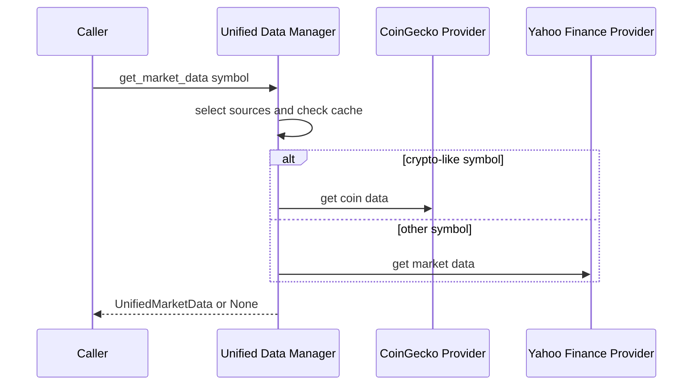

# Unified market data providers

`data/unified_data_manager.py` provides an asynchronous facade over `YahooFinanceProvider` and `CoinGeckoProvider`. Its public normalized record is `UnifiedMarketData`, which contains common price/change/volume fields, a provider name, update time, confidence score, and provider-specific values in `additional_metrics`.

This diagram shows source ordering; failures in one provider are caught and allow the next configured provider to be tried.

## Lifecycle, routing, and cache

Call `await initialize()` before using the manager. It asynchronously initializes both providers and sets `is_initialized` when either succeeds; it returns false only when neither initializes. `await close()` currently closes the CoinGecko provider.

`_determine_data_source` identifies symbols ending in `-USD`/`USD` and a small named crypto set (`BTC`, `ETH`, `SOL`, and others) as CoinGecko-first. Yahoo Finance is always appended as the default fallback. On a successful CoinGecko lookup, the manager first calls `get_coin_data` with a normalized lower-case symbol and then searches if necessary. On a Yahoo success, it converts `YahooFinanceData`; each conversion assigns a fixed source-specific confidence score in this layer.

The cache key combines the requested symbol and `int(timestamp / 300)`. Consequently a result is reused only inside the same five-minute bucket and repeated equivalent spellings are distinct keys. `get_multi_asset_data` uses `asyncio.gather` and returns only successful `UnifiedMarketData` values; individual errors are logged and omitted.

## Data contract and scope boundary

Consumers should depend on `UnifiedMarketData`, not a provider-specific dataclass. Provider-specific measures belong under `additional_metrics`: Yahoo conversion includes PE ratio, dividend yield, beta, EPS, and 52-week values; CoinGecko conversion includes rank, supply figures, and 7/30-day changes.

This manager also supplies `get_market_overview`, `search_symbols`, `get_portfolio_data`, and `get_system_status`. It is **not** wired into `ModelOrchestrator` by the inspected source: the [decision pipeline](../architecture/decision-pipeline.md) expects a generic context containing prices, indicators, portfolio data, and market data. Any change intended to feed this manager into decisions must introduce and test that integration explicitly rather than relying on the presence of both systems.

The repository contains additional providers and richer context/fusion modules under `data/`, but they are not part of `UnifiedDataManager`'s `providers` map. Keep their behavior separate unless source wiring adds them.

## Change navigation and validation

When adding a source, change `__init__`, initialization/close lifecycle, routing, conversion, and status reporting coherently. Define how a failed provider falls through and whether its fields can be normalized without breaking the `UnifiedMarketData` contract. Add a focused async test that covers source selection, cache-hit behavior, conversion fields, and partial failure; the existing `data/test_*.py` files are integration-oriented and may require external setup.

For a syntax-only local check use `python -m py_compile data/unified_data_manager.py`. Provider-key configuration, network calls, and any downstream trading decision are broader conditional checks; consult [execution safety gates](../execution/safety-gates.md) before testing a path that can lead toward execution.
