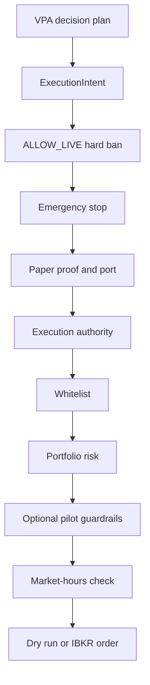

# Paper execution safety gates and IBKR contracts

`bin/vpa_executor.py` is the operational VPA-to-IBKR adapter. It parses a VPA `decision_plan` into `ExecutionIntent` values, runs its autonomous gates, builds a stock or futures contract, and either logs a dry-run result or transmits to IBKR. The adapter composes `ExecutionAuthority`, `WhitelistManager`, and `PortfolioRiskManager`; those engines are the canonical owners of their individual policies.

This diagram summarizes the enforced order of `VPAExecutor.enforce_autonomous_safety_gates`; a rejection returns a `GuardrailResult` rather than continuing.

## Non-negotiable safety behavior

- At construction and gate 0, `ALLOW_LIVE=true` is prohibited. The executor touches `EMERGENCY_STOP` and raises/blocks.
- Gate 1 also stops if the emergency-stop file exists. Gate 2 requires IB port `4002`; lack of `state/paper_account_ok.txt` is recorded as a warning rather than an immediate rejection in this adapter.
- `ExecutionAuthority.check()` is independently fail-closed. Its environment-based defaults reject `QUANTUM_EXECUTION_DRY_RUN=true`, `PAPER_EXECUTION_MODE` other than true, any `ALLOW_LIVE` value other than false, and an `IB_PORT` other than `4002`; it then enforces the configured Berlin-time weekday window in `config/execution_authority.yaml`.
- Gate 4 validates the selected `WHITELIST_PROFILE`; missing or malformed profiles block. Gate 5 rejects unavailable equity/positions and calculates USD notional, per-symbol, gross/net, daily-loss, drawdown, cooldown, and order-count limits through `PortfolioRiskManager`.
- Gate 7 uses a simplified UTC market-hours approximation. When closed and `EXECUTION_TRANSMIT_WHEN_CLOSED` is false, the result is `PAYLOAD_VALIDATION_ONLY`, not a transmitted order.

The paper-production runner described in [paper runtime](../operations/paper-runtime.md) adds preflight sequencing around this boundary. Model decisions and VPA creation are owned by the [decision pipeline](../architecture/decision-pipeline.md).

## Intent and contract invariants

`ExecutionIntent` accepts `BUY`, `SELL`, or `HOLD`; only `MKT` and `LMT` order types are valid, and a limit order needs `limit_price`. An intent needs either exact `quantity` or `target_value_pct`. `HOLD`/`NONE` entries are skipped while parsing.

Stock is the backwards-compatible default. A `FUT` intent must include `contract_metadata`; `build_ib_order` uses its `expiry`, `exchange`, and `currency` to construct an `ib_insync.Future`. The executor's `_parse_single_intent` currently does not map `instrument_type` or `contract` fields from the plan into `ExecutionIntent`; therefore a schema test or manual VPA shape alone does not establish a runnable futures path. Trace both producer and parser before enabling a futures workflow.

The lower-level instrument layer is clearer for futures changes:

- `instruments/spec.py` supplies `FutureSpec` and `StockSpec`. A future expiry must be `YYYYMM` and the multiplier must be positive.
- `instruments/ibkr_futures_adapter.py` loads `MES`/`MNQ` specs from `config/instruments.yaml`, exposes contract metadata, and validates the configured multiplier when building a contract.
- `config/instruments.yaml` labels futures expiry as a monthly maintenance item. Update it with the corresponding test expectation where it is hard-coded; `tests/test_futures_adapter.py` currently asserts `202603`.

## State and receipts

The executor derives an idempotency key from current date, symbol, action, and exact quantity or target percent. `_is_duplicate_order` stores recent keys in `state/executed_keys.json` and considers them duplicates for `QUANTUM_EXECUTION_IDEMPOTENCY_TTL` seconds. A future change to key composition changes duplicate semantics and must cover retry/TTL behavior.

`PortfolioRiskManager` persists rolling state atomically to `state/risk_state.json`; it resets daily counters by UTC date, starts cooldown after the configured daily-loss limit, and uses contract multipliers for futures/options notional. The risk configuration lives in `config/risk_limits.yaml`. Execution receipt locations and VPA/state paths in `bin/vpa_executor.py` are absolute deployment paths, so a checkout-local test must not be assumed to exercise production storage.

## Change recipes and focused checks

**Change an authority or risk constraint.** Change the owning YAML and the matching engine (`ExecutionAuthority` or `PortfolioRiskManager`), then test both a permitted and blocked outcome. Preserve fail-closed behavior for unavailable data, invalid configs, and stop files. `python engine/execution_authority.py --override-time 2026-01-26T10:00:00+00:00` is a narrow authority probe; it exits nonzero for a blocked result.

**Add or roll a futures contract.** Update `config/instruments.yaml`, preserve `FutureSpec` format/multiplier requirements, and run `python -m pytest tests/test_futures_adapter.py -q`. If expiry changes, update source-backed tests that explicitly pin it. Do not hand-edit IBKR derived contract objects; `FutureSpec.to_ib_contract` and `IBKRFutureAdapter.build_contract` own construction.

**Extend a VPA decision field.** Update producer, parser, and contract construction together. Retain stock defaults and require metadata for futures. Run `python -m pytest tests/test_decision_plan_futures_schema.py -q` and, if futures adapter behavior changes, the adapter test above. The broader broker smoke test is conditional on a configured paper gateway; it is not a default unit check.

`tests/test_safety.py` documents repository-level safety intentions, but imports a missing `src/quantum_trading_bot.config.quantum_runtime` path in this checkout. Treat it as a verification lead, not evidence that those assertions currently run.
