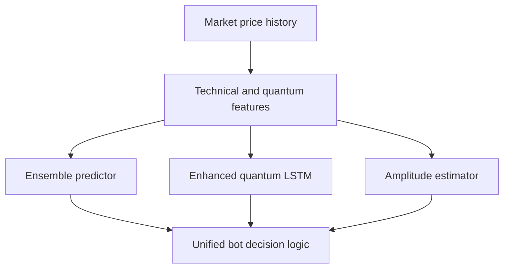

# Quantum-inspired analysis and machine-learning stack

The repository's quantum code is organized as independently callable algorithm modules rather than as `ModelRegistry` plugins. `quantum_signal_generation/` contains Fourier/cycle, trend, momentum, and enhanced analysis; `quantum_machine_learning/` contains quantum-inspired neural network, SVM, Boltzmann machine, amplitude estimation, and ensemble predictor implementations; `ml/enhanced_quantum_lstm.py` supplies the enhanced LSTM.

`bin/unified_quantum_trading_bot.py` is their observed integration point. `UnifiedQuantumTradingBot._initialize_quantum_components` tries to create an `EnsembleQuantumPredictor`, an enhanced LSTM, and `QuantumAmplitudeEstimator`. Import or initialization failure sets all three attributes to `None`, allowing the bot to continue with its stated classical fallback posture. This is separate from the configurable [decision pipeline](../architecture/decision-pipeline.md), which selects only models registered in `models/registry.py`.

This diagram reflects the components initialized and described by `UnifiedQuantumTradingBot`; it does not imply that they are model-zoo registrations or execution safety controls.

## Important separation of concerns

The unified bot directly connects to IBKR with `ib_insync.IB`, requests delayed market data, and fetches history from `yfinance`. It defines its own symbol universe, risk constants, client ID, update interval, absolute import paths, and log directory. It does not import `VPAExecutor`, `ExecutionAuthority`, `WhitelistManager`, or `PortfolioRiskManager` in the inspected source. A quantum-algorithm change therefore does not automatically inherit the [paper execution safety gates](../execution/safety-gates.md); an integration change that connects these paths must preserve both systems' contracts and add end-to-end paper-only validation.

`tests/test_quantum_algorithms.py` is an executable test harness that generates synthetic time series and checks algorithm-specific result keys. Its named methods include `test_qft_analyzer`, `test_qpe_detector`, and `test_quantum_walk`; continue from those behavior names when locating analogous coverage. It imports the signal-generation and quantum-ML modules directly rather than exercising the unified bot's broker lifecycle.

## Safe extension recipe

1. Keep the algorithm's public factory and result keys stable, or update direct consumers and the harness that asserts those keys.
2. If adding a member to the ensemble, update the ensemble configuration/weighting and test a valid prediction path plus unavailable/degraded behavior.
3. If adding the component to `UnifiedQuantumTradingBot`, place initialization in `_initialize_quantum_components`, honor the existing `QUANTUM_ML_AVAILABLE` fallback, and avoid treating a failed optional import as a valid prediction.
4. Do not claim a new algorithm is selectable by the model-zoo pipeline unless it also implements the appropriate interface, is registered in `ModelRegistry`, and has a `config/model_zoo.yaml` selection path.
5. Run `python tests/test_quantum_algorithms.py` for the existing broad algorithm harness. It may take materially longer than a unit test because it generates data and runs multiple algorithms; use it when algorithm behavior changes, not for documentation-only or execution-gate changes.

The enhanced LSTM has its own `ml/test_enhanced_quantum_lstm.py`. Run it when altering that module specifically. No package build/export mirror is evident for these root-level modules, so correctness is source/import based rather than a shipped-package surface—but the console-script/package discrepancy recorded in [quickstart](../quickstart.md#backlog) remains a repository-level concern.
