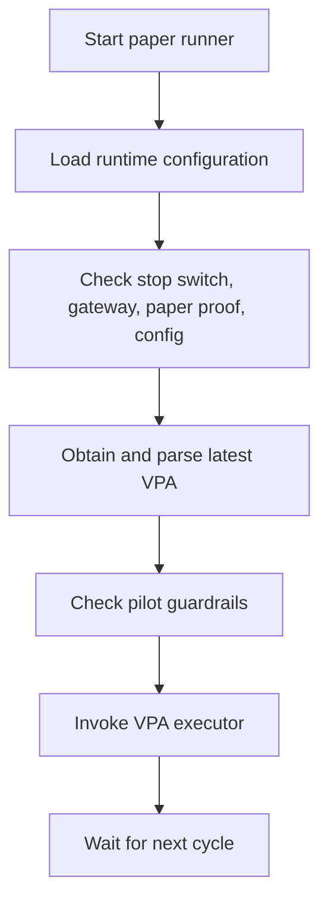

# Paper-production runtime and service wiring

`bin/run_paper_production.sh` is an operational shell loop for guarded paper trading. It sources a deployment runtime environment file, creates per-session logs and daily summaries, then executes cycles at a configured interval. It is not a portable development command: source paths are hard-coded under `/home/davidsanker/platform`, and broker/API preconditions are external.



This diagram captures the runner's intended operational sequence; the VPA executor applies the deeper gates documented in [execution safety gates](../execution/safety-gates.md).

## Preflight and cycle boundary

Before a cycle, the script checks its `EMERGENCY_STOP` file, counts receipts against a daily cap, verifies gateway health through `bin/validate_ib_gateway.sh`, refreshes `state/paper_account_ok.txt` if older than 55 minutes, and asserts `TRADING_MODE=paper`, `ALLOW_LIVE` not true, and `IB_PORT=4002`. It separately has a UTC weekday/market-hours check. When it executes a VPA it calls:

```bash
python3 "$PLATFORM/bin/vpa_executor.py" --vpa-file "$vpa_file" --config "$PLATFORM/config/quantum_runtime.env" --dry-run false
```

That command may still reject the order or create a non-transmission payload-validation result; a successful shell-loop transition is not an authorization bypass. The VPA producer and plan semantics are documented in the [decision pipeline](../architecture/decision-pipeline.md).

## Service files

Two systemd units describe distinct runtime strategies:

- `ops/systemd/trading-bot.service` requires `ib-gateway.service`, performs port/model-directory/healthcheck preflight, runs `bin/start_trading_bot.sh`, and restarts on failure with a 60-second delay.
- `ops/systemd/quantum-trading-bot-autoreconnect.service` runs `bin/quantum_bot_with_autoreconnect.py`, configures paths/display, requests restart `always`, and has a 300-second systemd watchdog.

Both files include deployment-specific user, working-directory, Python path, and log-path values. Treat them as templates tied to that environment, not as a statement that the current checkout can be enabled unchanged. The `trading-bot.service` comments point to a documentation file absent from this checkout; rely on the actual `ExecStart*` directives during changes.

## Change navigation and validation

Consult this page for startup ordering, gateway/reconnect setup, service unit behavior, and paper-run sequencing. Start in `run_one_cycle` for shell flow and `execute_vpa` for the handoff. Any safety-policy change belongs in [execution safety gates](../execution/safety-gates.md), where the source-owned authority, whitelist, risk, and order rules are documented.

Use `bash -n bin/run_paper_production.sh` after editing shell syntax. Run `tests/test_gateway_api.sh` only when changing the real gateway boundary and a paper gateway is intentionally configured; it is integration validation, not a routine check. After changing a systemd unit, validate it on the target host with `systemd-analyze verify` against the deployed unit path—do not start an IBKR-connected service merely to check syntax.
